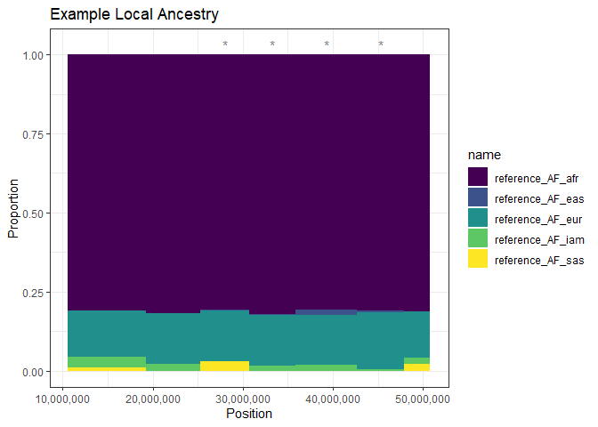

<!-- README.md is generated from README.Rmd. Please edit that file -->

# Summix2

<!-- badges: start -->
<!-- badges: end -->

Summix2 is a suite of methods that detect and leverage substructure in
genetic summary data. This package builds on Summix, a method that
estimates and adjusts for substructure in genetic summary that was
developed by the Hendricks Research Team at the University of Colorado
Denver.

Find more details about Summix in our [**manuscript published in the
American Journal of Human
Genetics**](https://doi.org/10.1016/j.ajhg.2021.05.016).

For individual function specifics in Summix2:

[**summix**](#summix) — [fast forward to
example](#a-quick-demo-of-summix)

[**adjAF**](#adjaf) — [fast forward to example](#a-quick-demo-of-adjaf)

[**summix_local**](#summix_local) — [fast forward to
example](#a-quick-demo-of-summix_local)

# Package Installation

To install Summix2, ensure you are in the devel version of R- (to
install in Windows click
[here](https://cran.r-project.org/bin/windows/base/rdevel.html)). Start
R (version “4.4”)-the devel version- and run the following commands:

``` r
if(!requireNamespace("BiocManager", quietly = TRUE))
    install.packages("BiocManager")

#The following initializes usage of the Bioconductor development version of Summix2
BiocManager::install(version = "devel")

BiocManager::install("Summix")
```

<br><br><br>

# summix

The *summix()* function estimates mixture proportions of reference
groups within genetic summary (allele frequency) data using sequential
quadratic programming performed with the [**slsqp()
function**](https://www.rdocumentation.org/packages/nloptr/versions/1.2.2.2/topics/slsqp)
in the nloptr package.

## *summix()* Input

Mandatory parameters are:

- **data**: A data frame of the observed and reference group allele
  frequencies for N genetic variants.

- **reference**: A character vector of the column names for K reference
  groups.

- **observed**: A character value that is the column name for the
  observed group.

Optional parameters are:

- **pi.start**: Numeric vector of length K containing the user’s initial
  guess for the reference group proportions. If not specified, this
  defaults to 1/K where K is the number of reference groups.

- **goodness.of.fit**: Default value is *TRUE*. If set as *FALSE*, the
  user will override the default goodness of fit measure and return the
  raw objective loss from *slsqp()*.

- **override_removeSmallRef**: Default value is *FALSE*. If set as
  *TRUE*, the user will override the automatic removal of reference
  groups with \<1% global proportions - this is not recommended.

## summix() Output

A data frame with the following columns:

- **goodness.of.fit**: Scaled objective loss from *slsqp()* reflecting
  the fit of the reference data. Values between 0.5-1.5 are considered
  moderate fit and should be used with caution. Values greater than 1.5
  indicate poor fit, and users should not perform further analyses using
  Summix2.

- **iterations**: The number of iterations for the SLSQP algorithm
  before best-fit reference group proportion estimates are found.

- **time**: The time in seconds before best-fit reference group mixture
  proportion estimations are found by the SLSQP algorithm.

- **filtered**: The number of genetic variants not used in the reference
  group mixture proportion estimation due to missing values.

- **K columns** of mixture proportions of reference groups input into
  the function.

<br><br><br>

## adjAF

The *adjAF()* function adjusts allele frequencies to match reference
group substructure mixture proportions in a given target group or
individual.

## *adjAF()* Input

Mandatory parameters are:

- **data**: A data frame containing the unadjusted allele frequency for
  the observed group and K reference group allele frequencies for N
  genetic variants.

- **reference**: A character vector of the column names for K reference
  groups.

- **observed**: A character value that is the column name for the
  observed group.

- **pi.target**: A numeric vector of the mixture proportions for K
  reference groups in the target group or individual.

- **pi.observed**: A numeric vector of the mixture proportions for K
  reference groups in the observed group.

- **N_reference**: A numeric vector of the sample sizes for each of the
  K reference groups that is in the same order as the reference
  parameter.

- **N_observed**: A numeric value of the sample size of the observed
  group.

Optional parameters are:

- **adj_method**: User choice of method for the allele frequency
  adjustment; options *“average”* and *“effective”* are available.
  Defaults to *“average”*.

- **filter**: Sets adjusted allele frequencies equal to 1 if \> 1, to 0
  if \> -.005 and \< 0, and removes adjusted allele frequencies \<
  -.005. Default is *TRUE*.

## adjAF() Output

A data frame with the following columns:

- **pi**: A table of input reference groups, pi.observed, and pi.target.

- **observed.data**: The name of the data column for the observed group
  from which the adjusted allele frequencies are estimated.

- **Nsnps**: The number of SNPs for which adjusted AF is estimated.

- **adjusted.AF**: A data frame of original data with an appended column
  of adjusted allele frequencies.

- **effective.sample.size**: The sample size of individuals effectively
  represented by the adjusted allele frequencies.

<br><br><br>

# summix_local

The *summix_local()* function estimates local ancestry mixture
proportions in genetic summary data using the same *slspq()*
functionality as *summix()*. *summix_local()* also performs a selection
scan (optional) that identifies regions of selection along the given
chromosome.

## *summix_local()* Input

Mandatory parameters are:

- **data**: A data frame of the observed group and reference group
  allele frequencies for N genetic variants on a single chromosome. Must
  contain a column specifying the genetic variant positions.

- **reference**: A character vector of the column names for K reference
  groups.

- **observed**: A character value that is the column name for the
  observed group.

- **position_col**: A character value that is the column name for the
  genetic variants positions. Default is *“POS”*.

- **maxStepSize**: A numeric value that defines the maximum gap in base
  pairs between two consecutive genetic variants within a given window.
  Default is 1000.

Optional parameters are:

- **algorithm**: User choice of algorithm to define local ancestry
  blocks; options *“fastcatch”* and *“windows”* are available.
  *“windows”* uses a fixed window in a sliding windows algorithm.
  *“fastcatch”* allows dynamic window sizes. The *“fastcatch”* algorithm
  is recommended- though it is computationally slower. Default is
  *“fastcatch”*.

- **type**: User choice of how to define window size; options
  *“variants”* and *“bp”* are available where *“variants”* defines
  window size as the number of variants in a given window and *“bp”*
  defines window size as the number of base pairs in a given window.
  Default is *“variants”*.

- **override_fit**: Default is *FALSE*. If set as *TRUE*, the user will
  override the auto-stop of *summix_local()* that occurs if the global
  goodness of fit value is greater than 1.5 (indicating a poor fit of
  the reference data to the observed data).

- **override_removeSmallAnc**: Default is *FALSE*. If set as *TRUE*, the
  user will override the automatic removal of reference ancestries with
  \<2% global proportions – this is not recommended.

- **selection_scan**: User option to perform a selection scan on the
  given chromosome. Default is *FALSE*. If set as *TRUE*, a test
  statistic will be calculated for each local ancestry block. Note: the
  user can expect extended computation time if this option is set as
  *TRUE*.

Conditional parameters are:

If **algorithm** = *“windows”*:

- **windowOverlap**: A numeric value that defines the number of variants
  or the number of base pairs that overlap between the given sliding
  windows. Default is 200.

If **algorithm** = *“fastcatch”*:

- **diffThreshold**: A numeric value that defines the percent difference
  threshold to mark the end of a local ancestry block. Default is 0.02.

If **type** = *“variants”*:

- **maxVariants**: A numeric value that specifies the maximum number of
  genetic variants allowed to define a given window.

If **type** = *“bp”*:

- **maxWindowSize**: A numeric value that defines the maximum allowed
  window size by the number of base pairs in a given window.

If **algorithm** = *“fastcatch”* and **type** = *“variants”*:

- **minVariants**: A numeric value that specifies the minimum number of
  genetic variants allowed to define a given window.

If **algorithm** = *“fastcatch”* and **type** = *“bp”*:

- **minWindowSize**: A numeric value that specifies the minimum number
  of base pairs allowed to define a given window.

If **selection_scan** = *TRUE*:

- **NSimRef**: A numeric vector of the sample sizes for each of the K
  reference groups that is in the same order as the reference parameter.
  This is used in a simulation framework that calculates within local
  ancestry block standard error.

## summix_local() Output

A data frame with a row for each local ancestry block and the following
columns:

- **goodness.of.fit**: Scaled objective loss from *slsqp()* reflecting
  the fit of the reference data. Values between 0.5-1.5 are considered
  moderate fit and should be used with caution. Values greater than 1.5
  indicate poor fit, and users should not perform further analyses using
  Summix2.

- **iterations**: The number of iterations for the SLSQP algorithm
  before best-fit reference group mixture proportion estimations are
  found.

- **time**: The time in seconds before best-fit reference group mixture
  proportion estimations are found by the SLSQP algorithm.

- **filtered**: The number of genetic variants not used in the reference
  group mixture proportion estimation due to missing values.

- **K columns** of mixture proportions of reference ancestry in the
  given local ancestry block.

- **nSNPs**: The number of genetic variants in the given local ancestry
  block.

Additional Output if **selection_scan** = *TRUE*:

- **K columns** of local ancestry test statistics for each reference
  ancestry in the given local ancestry block.

- **K columns** of p-values for each reference ancestry in the given
  local ancestry block. P-values calculated using the Student’s
  t-distribution with degrees of freedom=(nSNPs in the block)-1.
  <br><br><br>

# Examples using toy data in the Summix package

For quick runs of all demos, we suggest using the data saved within the
Summix library called ancestryData.

## A quick demo of summix()

The commands:

``` r
library(Summix)

# load the data
data("ancestryData")

# Estimate 5 reference ancestry proportion values for the gnomAD African/African American group
# using a starting guess of .2 for each ancestry proportion.
summix(data = ancestryData,
    reference=c("reference_AF_afr",
        "reference_AF_eas",
        "reference_AF_eur",
        "reference_AF_iam",
        "reference_AF_sas"),
    observed="gnomad_AF_afr",
    pi.start = c(.2, .2, .2, .2, .2),
    goodness.of.fit=TRUE)
#>   goodness.of.fit iterations          time filtered reference_AF_afr
#> 1       0.4853597         20 0.221664 secs        0         0.812142
#>   reference_AF_eur reference_AF_iam
#> 1         0.169953         0.017905
```

<br><br><br><br>

## A quick demo of adjAF()

The commands:

``` r
library(Summix)

# load the data
data("ancestryData")


adjusted_data<-adjAF(data = ancestryData,
     reference = c("reference_AF_afr", "reference_AF_eur"),
     observed = "gnomad_AF_afr",
     pi.target = c(1, 0),
     pi.observed = c(.85, .15),
     adj_method = 'average',
     N_reference = c(704,741),
     N_observed = 20744,
     filter = TRUE)
#> [1] "Average fold change between observed and target group proportions is: 0.58"
#> 
#> 
#> [1] "Note: In this AF adjustment, 0 SNPs (with adjusted AF > -.005 & < 0) were rounded to 0. 0 SNPs (with adjusted AF > 1) were rounded to 1, and 0 SNPs (with adjusted AF <= -.005) were removed from the final results."
#> 
#> [1] $pi
#>          ref.group pi.observed pi.target
#> 1 reference_AF_afr        0.85         1
#> 2 reference_AF_eur        0.15         0
#> 
#> [1] $observed.data
#> [1] "observed AF data to update: 'gnomad_AF_afr'"
#> 
#> [1] $Nsnps
#> [1] 1000
#> 
#> 
#> [1] $effective.sample.size
#> [1] 17632
#> 
#> 
#> [1] "use $adjusted.AF$adjustedAF to see adjusted AF data"
#> 
#> 
#> [1] "Note: The accuracy of the AF adjustment is likely lower for rare variants (< .5%)."
print(adjusted_data$adjusted.AF[1:5,])
#>        POS REF ALT CHROM reference_AF_afr reference_AF_eas reference_AF_eur
#> 1 31652001   T   A chr22      0.040925268                0      0.000000000
#> 2 34509945   C   G chr22      0.217971527                0      0.000000000
#> 3 34636589 CAA   C chr22      0.181117576                0      0.001149425
#> 4 38889885   A AAG chr22      0.007117446                0      0.000000000
#> 5 49160931   G   T chr22      0.064056997                0      0.000000000
#>   reference_AF_iam reference_AF_sas gnomad_AF_afr  adjustedAF
#> 1                0                0    0.04171490 0.045000811
#> 2                0                0    0.18774500 0.219423999
#> 3                0                0    0.15198300 0.179859133
#> 4                0                0    0.00422064 0.006041453
#> 5                0                0    0.05445710 0.064062087
```

<br><br><br><br>

## A quick demo of summix_local()

The commands:

``` r
library(Summix)

# load the data
data("ancestryData")

results <- summix_local(data = ancestryData,
                        reference = c("reference_AF_afr", 
                                      "reference_AF_eas", 
                                      "reference_AF_eur", 
                                      "reference_AF_iam", 
                                      "reference_AF_sas"),
                        NSimRef = c(704,787,741,47,545),
                        observed="gnomad_AF_afr",
                        goodness.of.fit = T,
                        type = "variants",
                        algorithm = "fastcatch",
                        minVariants = 150,
                        maxVariants = 250,
                        maxStepSize = 1000,
                        diffThreshold = .02,
                        override_fit = F,
                        override_removeSmallAnc = TRUE,
                        selection_scan = T,
                        position_col = "POS")
#> [1] "Done getting LA proportions"
#> [1] "Running internal simulations for SE"
#> Time difference of 9.383054 mins
#> [1] "Discovered 7 LA blocks"

print(results$results)
#>   Start_Pos  End_Pos goodness.of.fit iterations       time filtered
#> 1  10595784 19258643       1.2555376         10 0.07548189        0
#> 2  19258643 25252606       0.5018649         13 0.07127094        0
#> 3  25252606 30743600       0.2304807         11 0.08539486        0
#> 4  30743600 35846592       0.2933341         14 0.06851101        0
#> 5  35846592 42706228       0.5480859         14 0.08244109        0
#> 6  42706228 47902876       0.2634092         11 0.07294583        0
#> 7  47902876 50791970       0.2891929         10 0.07040882        0
#>   reference_AF_afr reference_AF_eas reference_AF_eur reference_AF_iam
#> 1         0.809208         0.000000         0.146185         0.034417
#> 2         0.816933         0.000000         0.161511         0.021556
#> 3         0.805795         0.002730         0.160926         0.000000
#> 4         0.820812         0.002558         0.161353         0.015276
#> 5         0.806428         0.016357         0.157855         0.019360
#> 6         0.810130         0.004046         0.181798         0.004025
#> 7         0.811265         0.000000         0.148492         0.019896
#>   reference_AF_sas nSNPs t.reference_AF_afr.avg t.reference_AF_eas.avg
#> 1         0.010189   150            -0.42795221            -0.57486725
#> 2         0.000000   149             1.18141011            -1.11453341
#> 3         0.030550   149            -1.13377837            -0.16942835
#> 4         0.000000   149             2.19006335            -0.25074063
#> 5         0.000000   149            -1.18784435             2.51177407
#> 6         0.000000   149            -0.31049617             0.07874554
#> 7         0.020347   104            -0.04627383            -0.79354107
#>   t.reference_AF_eur.avg t.reference_AF_iam.avg t.reference_AF_sas.avg
#> 1             -1.1392104              1.7773989              0.1175114
#> 2              0.2228038              0.7002373             -1.5566442
#> 3              0.1353653             -2.9718846              2.0746419
#> 4              0.2104269             -0.1507887             -1.5009515
#> 5             -0.2100306              0.4150403             -1.0069988
#> 6              2.8132418             -1.7391332             -1.3565575
#> 7             -1.0533651              0.4586724              1.0416184
#>   p.reference_AF_afr p.reference_AF_eas p.reference_AF_eur p.reference_AF_iam
#> 1         1.33070028         1.43375769         1.74356857         0.07752908
#> 2         0.23932206         1.73315506         0.82399336         0.48487102
#> 3         1.74129158         1.13431047         0.89250579         1.99654787
#> 4         0.03007459         1.19763992         0.83362197         1.11965367
#> 5         1.76321522         0.01307846         1.16606931         0.67870940
#> 6         1.24338243         0.93734067         0.00556639         1.91592338
#> 7         1.03681927         1.57073055         1.70538514         0.64742656
#>   p.reference_AF_sas
#> 1         0.90661201
#> 2         1.87832352
#> 3         0.03973971
#> 4         1.86451576
#> 5         1.68443210
#> 6         1.82302630
#> 7         0.30000401
```

<br><br>

Below is an example of plotting the reference ancestry proportions
estimated in each block using *summix_local()*; where asterisks indicate
local ancestry blocks that are at least nominally significant
(p-value\<=.05).


